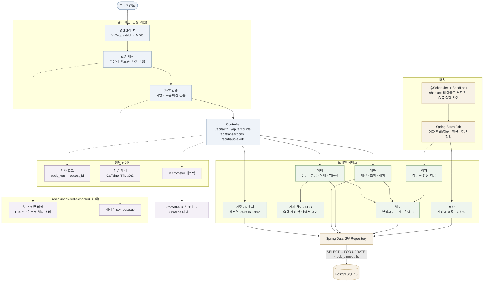
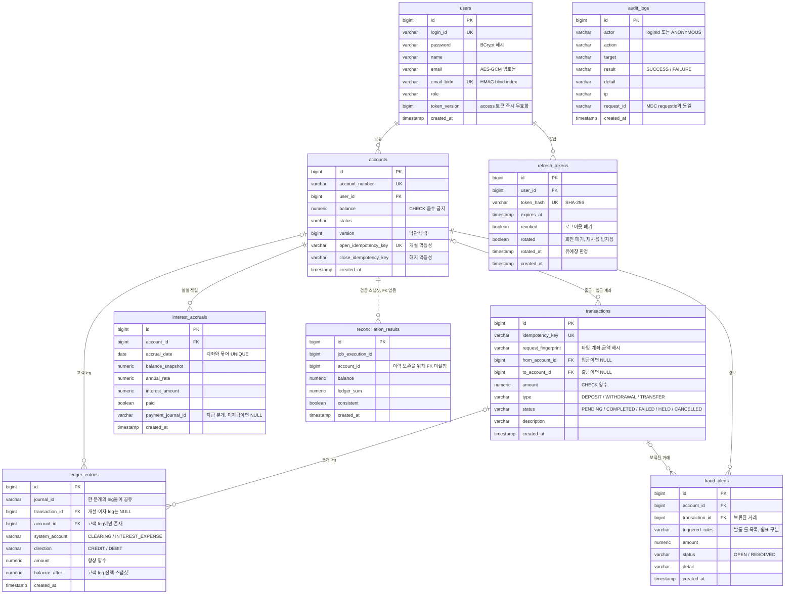

## 개인 프로젝트 - ibank (아주대학교 신우찬)

계좌 개설부터 입출금, 이체, 거래내역 조회 등의 기술을 구현
동시성 제어, 멱등성, 정합성 검증에 중점을 두었으며 그 외에도 금융권에서 중요시하는 개념들을 실제로 구현하고 싶은 생각에서 시작되었습니다.
**여러 요청이 같은 계좌를 동시에 건드려도 잔액이 깨지지 않는가** 라는 질문이 프로젝트의 핵심이며, 실무에 가깝게 구현하려 노력했습니다.

## 전체 구조

요청 하나가 어떤 순서로 계층을 지나고 그 과정에서 어디가 잠기는지를 그렸습니다. 잔액을 바꾸는 경로는 결국 전부 PostgreSQL의 행 락 한 곳으로 모입니다. 배치와 Redis는 본류 바깥에 두었습니다. 둘 다 없어도 단일 인스턴스는 그대로 돌아갑니다.

## 데이터 모델

Flyway 마이그레이션(V1~V22)에 정의된 스키마입니다. Spring Batch 메타데이터와 ShedLock 테이블은 도메인과 상관이 없어 뺐고, 컬럼도 설계 의도가 드러나는 것 위주로 추렸습니다. 눈여겨볼 곳은 `ledger_entries`입니다. 한 leg는 고객 계좌와 시스템 계정 중 정확히 한쪽에만 귀속되고, 같은 `journal_id`를 공유하는 leg들이 모여 합이 0인 분개를 이룹니다.

# 기술 스택

| 구분 |  |
|------|------|
| Language | Java 21 (LTS) |
| Framework | Spring Boot 4.0.6 (Web MVC, Data JPA, Security, Validation, Retry, Actuator, Batch) |
| DB | PostgreSQL 16 |
| 영속성 | JPA(쓰기·무결성) + MyBatis(동적 조회·집계 리포트) |
| Cache / 분산 | Caffeine(로컬) + Redis(분산 호출 제한·캐시 무효화 전파, 선택) |
| Auth | JWT(jjwt) + 회전형 Refresh Token |
| 관측 | Micrometer · Prometheus · Grafana · 상관관계 ID(MDC) · JSON 로깅 |
| 문서 | OpenAPI 3 (springdoc, Swagger UI) |
| Build | Gradle 8.14 (Kotlin DSL) |
| CI | GitHub Actions |

## API
| Method | Endpoint | 설명 | 인증 |
|--------|----------|------|:---:|
| POST | `/api/auth/register` | 회원가입 | — |
| POST | `/api/auth/login` | 로그인 (access + refresh 발급) | — |
| POST | `/api/auth/refresh` | 토큰 회전(재발급) | — |
| POST | `/api/auth/logout` | refresh 토큰 폐기 | — |
| POST | `/api/auth/sessions/invalidate` | 전체 세션 즉시 무효화(계정 도용 신고) | O |
| POST | `/api/accounts` | 계좌 개설 | O |
| GET | `/api/accounts/me` | 내 계좌 목록 | O |
| GET | `/api/accounts/{no}` | 계좌 단건 조회 | O |
| DELETE | `/api/accounts/{no}` | 계좌 해지 (잔액 0 필요) | O |
| POST | `/api/transactions/deposit` | 입금 | O |
| POST | `/api/transactions/withdraw` | 출금 | O |
| POST | `/api/transactions/transfer` | 이체 | O |
| GET | `/api/accounts/{no}/transactions` | 거래내역(페이징·기간필터) | O |
| GET | `/api/accounts/{no}/transactions/search` | 거래 상세 검색(유형·상태·금액대·방향·키워드) | O |
| GET | `/api/accounts/{no}/transactions/summary` | 월별 거래 요약 리포트 | O |

전체 스펙은 OpenAPI로 자동 생성됩니다 — 로컬 실행 후 `http://localhost:8080/swagger-ui.html` (운영 프로파일에서는 비노출).

## 동시성 제어

이체는 비관적 락(`SELECT ... FOR UPDATE`)으로 처리하며, 두 계좌를 항상 계좌번호 오름차순으로 잠가 데드락을 차단합니다. 양방향 이체 100건을 동시에 던지는 테스트로 확인했습니다. 락을 쥔 트랜잭션이 멈추면 뒤 이체가 전부 같이 멈추므로 DB에 `lock_timeout` 3초를 걸어 빨리 실패하고 재시도하는 쪽을 택했습니다.

## 멱등성

거래 요청마다 멱등성 키를 받고, 같은 키가 다시 오면 처리 없이 저장된 결과를 돌려줍니다. 검증은 락 전후 두 번 합니다. 같은 키를 든 요청 둘이 동시에 들어오면 늦은 쪽이 락 대기 중 먼저 온 쪽의 커밋을 두 번째 검증에서 보게 됩니다. 같은 키를 다른 금액에 재사용하는 경우는 요청 지문(타입·계좌·금액 해시)을 함께 저장해 두었다가 409로 거부합니다.

## 원장과 정산

모든 거래는 복식부기 원장에 합이 0이 되는 분개(journal) 단위로 기록됩니다. 이체는 출금 계좌 DEBIT와 입금 계좌 CREDIT 두 줄로 적습니다. 입금, 출금, 계좌 개설 초기 잔액처럼 돈이 시스템 외부 경계를 넘는 거래에서는 내부 클리어링 계정이 상대 leg를 집니다. 클리어링 계정은 잔액 행을 갱신하지 않고 원장 leg만 insert하므로(insert-only), 모든 입출금이 한 행을 잠그는 핫스팟 락 경합도 생기지 않습니다.

정산은 두 층위로 검사합니다. 계좌 층위에서는 계좌별로 `잔액 == CREDIT 합 − DEBIT 합` 불변식을 확인합니다. 잔액과 원장 합계는 단일 쿼리로 같은 스냅샷에서 읽습니다. 나눠 읽으면 그 사이 커밋된 이체가 read skew 오탐을 만듭니다. 시스템 층위에서는 모든 분개의 합이 0인지(zero-sum), 전 원장 시산표(trial balance)가 0인지 봅니다. 잔액과 원장이 함께 잘못되면 계좌별 검사는 통과하지만, 돈이 생기거나 사라진 사실은 시산표가 잡아냅니다. Spring Batch 정산 잡이 두 검사를 주기적으로 돌리고, 복식부기 위반이 발견되면 잡을 FAILED로 종료해 시끄럽게 표면화합니다.

잔액 음수 금지, 0원 이하 거래 금지, 동일 계좌 이체 금지에 더해, 원장 leg가 고객 계좌나 시스템 계정 중 정확히 하나에 귀속되어야 한다는 규칙도 DB CHECK 제약으로 걸어 두었습니다.

## 이자 계산

이자는 적립(accrual)과 지급(payment)을 분리한 두 배치로 처리합니다. 일일 배치가 계좌마다 그날의 일할 이자(`잔액 × 연이율 / 365`, 은행 관행대로 HALF_EVEN 반올림)를 `interest_accruals`에 한 행씩 적립하고, 월말 배치가 미지급 적립분을 합산해 계좌에 입금합니다.

적립은 `(계좌, 날짜)` 유니크 제약으로 같은 날 중복 적립이 불가능하고, 지급은 계좌의 비관적 락 안에서 미지급분을 다시 읽어 합산하므로 배치를 재실행하거나 겹쳐 돌려도 같은 이자를 두 번 주지 않습니다. 지급 시 입금·원장 분개·적립분 지급표시가 한 트랜잭션으로 묶입니다.

이자도 복식부기로 기록됩니다 — 고객 계좌 CREDIT과 은행의 이자 비용 계정(`INTEREST_EXPENSE`) DEBIT으로 합이 0인 분개를 남깁니다. 따라서 이자 지급 후에도 정산 불변식(잔액 == 원장 합, 시산표 == 0)이 그대로 성립합니다.

## 거래 한도

단건 한도(기본 1,000만 원)와 계좌별 1일 누적 출금 한도(기본 5,000만 원)를 검증합니다. 단건 한도는 DB 접근이 필요 없으므로 락 획득 전에 fail-fast로 검사하고, 1일 한도는 출금 계좌의 비관적 락을 쥔 상태에서 당일 완료된 출금 합계를 조회해 검사합니다. 락이 계좌 단위 출금을 직렬화하므로, 동시 요청 여러 건이 각자 잔여 한도를 조회해 "각각은 한도 이내지만 합치면 초과"가 되는 우회(TOCTOU)도 막힙니다. 거부된 요청은 거래를 만들지 않아 한도를 소모하지 않고, 멱등 재시도는 한도 검사보다 먼저 단락되므로 이미 완료된 거래를 다시 요청해도 한도에 걸리지 않습니다. 한도는 `ibank.limits.*` 설정으로 조정합니다.

## 이상거래 탐지 (FDS)

거래 한도(정적 임계)만으로는 잡지 못하는 패턴을 룰 기반으로 탐지합니다. 출금 계좌의 비관적 락을 쥔 상태에서 평가하므로(거래 한도와 같은 자리), velocity 카운트가 동시 요청에 흔들리는 레이스(TOCTOU)가 없습니다.

- **velocity** — 짧은 창(기본 5분) 안에서 한 계좌의 출금성 거래가 임계 횟수 이상
- **심야 고액** — 심야 시간대(기본 0~5시)의 임계액 이상 이체
- **신규 수취인 고액** — 거래 이력이 없는 계좌로의 임계액 이상 이체

탐지되면 이체를 즉시 거절하지 않고 **보류(HELD)** 합니다. 자금은 출금 계좌에 그대로 남고(원장 항목을 만들지 않으므로 정산 불변식에 영향 없음), 거래는 HELD로 기록되며 `fraud_alerts`에 검토용 경보가 남습니다. 멱등성 키는 보류된 거래가 소비하므로 같은 요청을 재시도해도 같은 보류 결과가 반환됩니다. 운영자는 OPEN 경보를 검토 큐로 처리합니다(해제/반려 워크플로는 후속 과제). 기본 비활성이며 `ibank.fraud.*`로 임계치를 조정합니다.

## 조회와 리포트 (MyBatis)

조회 중에서 조건 조합이 많은 거래 검색과 집계 리포트는 MyBatis로 구현했습니다. 무결성과 락이 필요한 쓰기는 영속성 컨텍스트를 쓰는 JPA에 그대로 두고, 조건이 유형·상태·금액대·방향·키워드로 갈라지는 조회는 SQL을 직접 쥐는 편이 낫다고 봤습니다. 하나로 통일하는 대신 도구를 강점대로 나눈 셈입니다.

두 경로는 같은 DataSource를 쓰므로 트랜잭션과 커넥션을 공유합니다. 소유권 검증(JPA)과 검색(MyBatis)이 하나의 읽기 전용 트랜잭션 안에서 끝납니다. 매퍼에는 검증이 끝난 계좌 ID만 넘기고, 클라이언트가 보낸 값은 전부 `#{}` 바인딩으로만 들어갑니다. 정렬 키처럼 컬럼명이 바뀌는 자리는 문자열 대신 enum으로 닫아 두어 사용자 입력이 SQL 식별자로 흘러들 여지를 없앴습니다.

상대 계좌번호는 자바 `switch`로 계산하던 것을 조인과 `CASE`로 옮겨 한 번의 조회로 채웁니다. 페이징은 Spring Data의 `Page`가 없으므로 count 쿼리와 `LIMIT/OFFSET`을 조합해 직접 만듭니다. OFFSET 방식은 뒤 페이지로 갈수록 건너뛸 앞 행을 세느라 느려지므로, 데이터가 커지면 `created_at`·`id` 기준 keyset 페이징으로 옮기는 것이 맞습니다.

## 호출 제한 (Rate limit)

로그인은 실패 누적 기반 brute-force 방어가 별도로 있고, 그 외 일반 API는 보호가 없던 문제를 보완했습니다.
출발지 IP 단위 토큰 버킷으로 모든 `/api/**` 요청의 호출 빈도를 제한하며, 초과 시 `429`와 `Retry-After`를 반환합니다.
인증보다 앞단(필터)에서 동작해 과도한 요청을 DB 작업 전에 차단합니다.
`ibank.rate-limit.*`로 용량·처리율을 조정하고, 운영(prod)에서 활성화됩니다(개발/부하측정 영향 없음).

## 다중 인스턴스 확장 (Redis)

단일 인스턴스에서는 외부 의존 없이 동작하고, `ibank.redis.enabled=true`면 인스턴스 수평 확장에 필요한 두 가지가 Redis로 옮겨갑니다.

- **분산 호출 제한** — 토큰 버킷의 보충·소비를 Lua 스크립트 한 번으로 처리해 원자성을 보장합니다. read-modify-write를 나눠 보내면 동시 요청이 같은 잔량을 읽고 각각 소비하는 레이스가 생기기 때문입니다. 동시 요청 20건 중 정확히 capacity건만 통과하는 테스트로 확인했습니다.
- **인증 캐시 무효화 전파** — 인증 핫패스 캐시는 성능을 위해 로컬(Caffeine)을 유지하고, 토큰 무효화 신호만 pub/sub으로 공유합니다. 어느 인스턴스로 라우팅되든 옛 토큰 버전이 캐시에서 살아남지 못합니다. pub/sub은 at-most-once지만 캐시 TTL(30초)이 지연 상한을 보장하는 2차 방어선으로 남습니다.

잔액 동시성 제어는 Redis 분산 락으로 옮기지 않고 DB 비관적 락을 유지합니다. 잔액의 진실 원천(source of truth)이 DB인 이상 락도 같은 곳에 있어야 락과 데이터가 한 트랜잭션으로 묶이기 때문입니다. 외부 락은 락 만료·시계 오차로 정합성이 깨질 틈이 생깁니다.

## 인증

refresh 토큰은 SHA-256 해시만 DB에 저장하고 재발급 때마다 회전시킵니다. 이미 회전된 토큰이 다시 들어오면 탈취로 간주해 전체 세션을 무효화하되, 회전 직후 2초 유예창 안의 재제출은 정상 재시도로 보고 거부만 합니다. 회전은 행 락으로 직렬화해 동시 refresh로 토큰 패밀리가 갈라지는 것을 막았습니다. 그 외에 토큰 버전 기반 access 토큰 즉시 무효화, 로그인 IP 단위 brute-force 방어, 이메일 at-rest 암호화 + blind index를 적용했습니다.

## 관측가능성 (Observability)

모든 요청에 상관관계 ID(`X-Request-Id`)를 부여합니다. 클라이언트가 보낸 ID는 형식 검증 후 이어받고 없으면 발급하며, 모든 로그 라인(MDC)과 감사 로그(`audit_logs.request_id`), 응답 헤더에 같은 ID가 실립니다. 장애 문의가 들어오면 응답 헤더의 ID 하나로 그 요청의 로그와 감사 기록을 끝까지 추적할 수 있습니다.

메트릭은 Micrometer로 수집해 Prometheus가 스크랩하고 Grafana로 봅니다. HTTP 지연 분포(p95/p99)와 함께 금융 행위 성공/실패, 멱등성 키 중복 적중, 호출 제한 거부 같은 비즈니스 카운터를 노출합니다. actuator는 서비스 포트와 분리된 관리 포트(8081)에서만 서빙되고, compose 환경에서 이 포트는 호스트에 공개되지 않아 내부 네트워크의 Prometheus만 접근합니다. 운영(prod) 로그는 JSON으로 구조화되어 수집기에서 `requestId` 필드로 바로 검색됩니다.

`docker compose up` 후 Grafana(http://localhost:3000, admin/admin)에 처리율·지연·커넥션 풀 대시보드가 자동 프로비저닝됩니다.

## 테스트

동시성은 Testcontainers로 실제 PostgreSQL을 띄워서 검증합니다.

- 동시 이체 후 총 잔액 보존
- 양방향 동시 이체에서 데드락 부재
- 같은 멱등성 키 동시 요청 시 정확히 1건만 처리
- 잔액 5,000원에 1,000원 출금 10건이 몰리면 정확히 5건 성공

이 네 가지가 깨지면 위 설계가 거짓말이 되므로 CI(GitHub Actions)에서 매번 돌립니다.

부하 테스트는 k6로 진행했습니다. 50 VU가 같은 출금 계좌 한 곳에 1원씩 동시에 이체를 퍼붓는 최악 경합 시나리오(단일 행 `FOR UPDATE` 락이 직렬화)를 30초간 돌립니다. Docker PostgreSQL 16 환경에서 워밍업 후 측정한 결과 **2,216건 이체, 실패 0%, p95 1.03s, 약 72 TPS**이며, 종료 후 두 계좌 잔액의 합이 초기 총액과 정확히 일치(`A + B = 100,000,000`)함을 확인했습니다. 처리량은 PostgreSQL의 디스크 I/O에 직접 좌우되며(락에 묶인 트랜잭션의 커밋 속도가 곧 처리량), 네이티브 PostgreSQL에서는 더 높게 측정됩니다.
