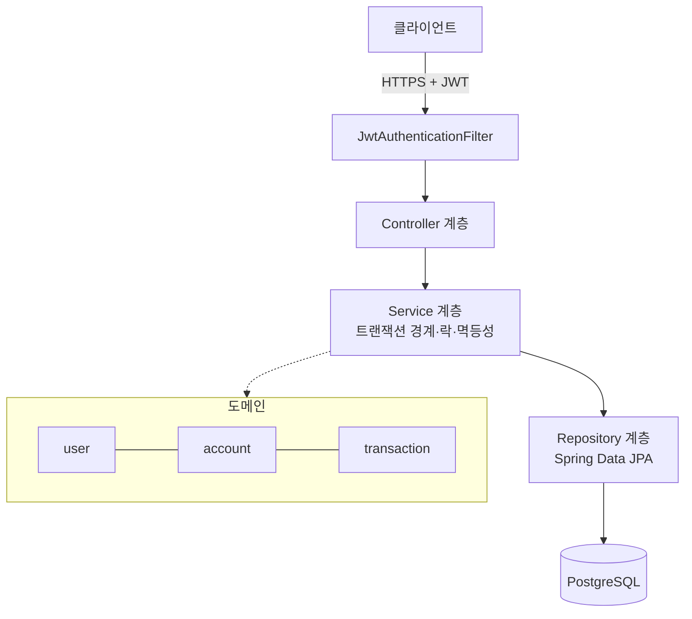
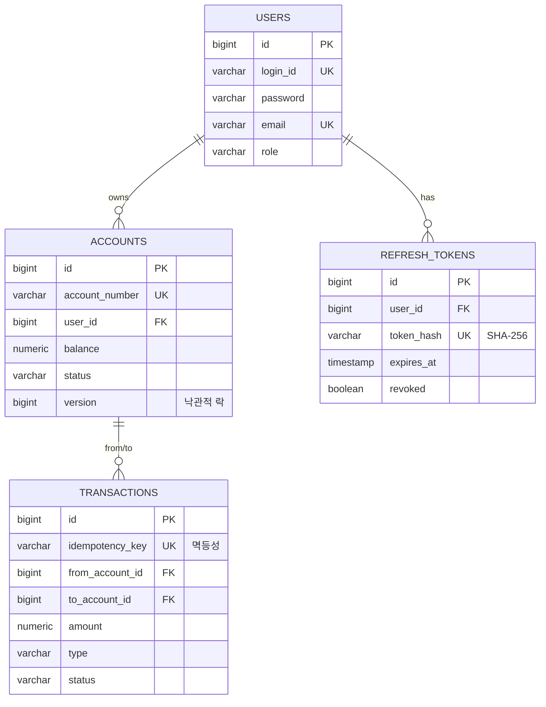
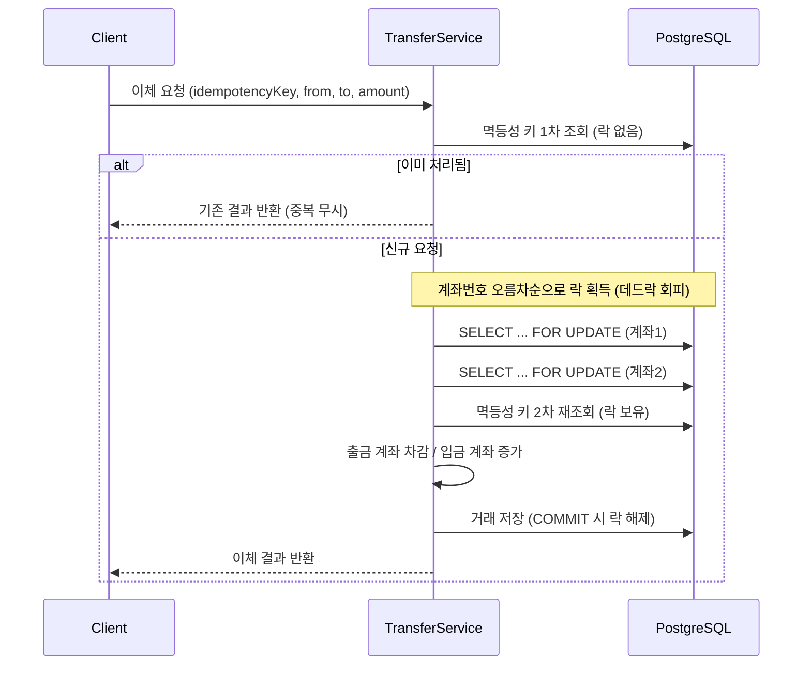

# ibank — 동시성·정합성 중심의 인터넷 뱅킹 백엔드

계좌 개설·입출금·이체·거래내역 기능을 갖춘 인터넷 뱅킹 백엔드입니다.
**"여러 요청이 동시에 같은 계좌를 건드려도 잔액이 절대 깨지지 않는다"** 는 금융 시스템의 핵심 요구사항을, 락 전략과 멱등성으로 어떻게 보장하는지에 초점을 맞췄습니다.

> 학습/포트폴리오 프로젝트. 동시성 제어·트랜잭션 정합성·보안·테스트를 실무에 가깝게 구현하는 것을 목표로 합니다.

---

## 핵심 특징

- **동시성 제어**: 비관적 락 + 낙관적 락을 상황에 맞게 분리 적용, 데드락 회피를 위한 **락 획득 순서 고정**
- **멱등성(Idempotency)**: 모든 금전 거래에 멱등성 키 → 네트워크 재시도/중복 요청에도 한 번만 반영
- **정합성 검증**: 동시 이체/입금 시 **총 잔액 보존**과 **음수 잔액 불가**를 통합 테스트로 증명
- **보안**: JWT(access 15분) + 회전형 refresh 토큰(14일), 로그인 brute-force 잠금, 예외 응답의 내부정보 유출 차단
- **테스트**: Testcontainers 기반 실제 PostgreSQL 통합/동시성 테스트 (총 58개)
- **CI**: GitHub Actions에서 매 PR마다 전체 빌드·테스트

---

## 기술 스택

| 구분 | 기술 |
|------|------|
| Language | Java 21 (LTS) |
| Framework | Spring Boot 4.0.6 (Web MVC, Data JPA, Security, Validation, Retry, Actuator) |
| DB | PostgreSQL 16, Flyway 마이그레이션 |
| Auth | JWT (jjwt) + 회전형 Refresh Token |
| Build | Gradle 8.14 (Kotlin DSL) |
| Test | JUnit 5, Testcontainers, Spring Security Test |
| CI | GitHub Actions |

---

## 아키텍처

도메인별로 패키지를 나눈 계층형 모놀리식 구조입니다.



**패키지 구조**

```
com.ibank
├── domain
│   ├── user          # 회원·인증·리프레시 토큰
│   ├── account       # 계좌 개설/조회/해지, 잔액 변경 도메인 규칙
│   └── transaction   # 입금/출금/이체, 거래내역
└── global
    ├── config        # Security, JWT 설정
    ├── security      # JWT 필터/프로바이더, 로그인 시도 제한
    ├── exception     # 전역 예외 처리, 도메인 예외 베이스
    └── response      # 공통 응답 포맷(ApiResponse)
```

---

## 데이터 모델 (ERD)



---

## 동시성 제어 전략 (핵심)

금전 거래는 **연산 특성에 따라 락 전략을 분리**했습니다.

| 연산 | 락 전략 | 이유 |
|------|---------|------|
| 이체 / 출금 / HTTP 입금 | **비관적 락** (`SELECT ... FOR UPDATE`) | 잔액 초과 인출을 원천 차단해야 하므로 충돌 시 대기가 더 안전·단순 |
| 대량 입금(낙관적 경로) | **낙관적 락** (`@Version`) + `@Retryable` | 충돌 확률이 낮아 락 대기보다 재시도가 처리량에 유리 |

**1. 데드락 회피 — 락 획득 순서 고정**
이체는 두 계좌의 락을 잡습니다. A→B와 B→A가 동시에 일어나면 서로의 락을 기다리며 데드락이 발생할 수 있습니다.
→ **항상 계좌번호 오름차순으로 락을 획득**하여 순환 대기를 제거합니다. (`TransferService#transfer`)

**2. 멱등성 — 중복 거래 방지**
모든 거래는 `idempotency_key`(UNIQUE)를 가집니다. 락 획득 전 1차 검사 + 락 보유 상태에서 2차 재검사(double-check)로, 동시에 같은 키로 들어온 요청도 단 한 번만 처리합니다. 최종 방어선은 DB UNIQUE 제약입니다.

**3. 잔액 도메인 규칙**
잔액 증감 로직은 `Account` 엔티티 내부에 캡슐화되어, 음수 잔액·비활성 계좌 거래를 도메인 레벨에서 차단합니다.

### 이체 시퀀스



---

## API 명세

모든 응답은 `{ "success": boolean, "data": ..., "message": ... }` 형식입니다. `/api/auth/**` 외 모든 요청은 `Authorization: Bearer <accessToken>` 필요.

| Method | Endpoint | 설명 | 인증 |
|--------|----------|------|:---:|
| POST | `/api/auth/register` | 회원가입 | — |
| POST | `/api/auth/login` | 로그인 (access + refresh 발급) | — |
| POST | `/api/auth/refresh` | 토큰 회전(재발급) | — |
| POST | `/api/auth/logout` | refresh 토큰 폐기 | — |
| POST | `/api/accounts` | 계좌 개설 | ✓ |
| GET | `/api/accounts/me` | 내 계좌 목록 | ✓ |
| GET | `/api/accounts/{no}` | 계좌 단건 조회 | ✓ |
| DELETE | `/api/accounts/{no}` | 계좌 해지 (잔액 0 필요) | ✓ |
| POST | `/api/transactions/deposit` | 입금 | ✓ |
| POST | `/api/transactions/withdraw` | 출금 | ✓ |
| POST | `/api/transactions/transfer` | 이체 | ✓ |
| GET | `/api/accounts/{no}/transactions` | 거래내역(페이징·기간필터) | ✓ |

---

## 보안

- **인증**: Stateless JWT. access 토큰 **15분**(짧게) + 불투명 refresh 토큰 **14일**(DB에 SHA-256 해시만 저장)
- **토큰 회전**: `/refresh` 시 기존 refresh 토큰을 폐기하고 새로 발급 → 탈취 토큰 재사용 창 최소화
- **Brute-force 방어**: 로그인 5회 실패 시 15분 일시 잠금(429)
- **정보 유출 차단**: 예외 응답에 계좌번호·잔액·원시 SQL 오류를 노출하지 않음(상세는 서버 로그로만)
- **운영 시크릿**: prod 프로파일에서 `JWT_SECRET`·DB 자격증명을 환경변수로 강제 → 미설정 시 기동 실패(fail-fast)

---

## 실행 방법

### 1) PostgreSQL (Docker)

```bash
docker run -d --name ibank-db -p 5432:5432 \
  -e POSTGRES_DB=ibank_db \
  -e POSTGRES_USER=ibank_user \
  -e POSTGRES_PASSWORD=ibank_pass \
  postgres:16-alpine
```

### 2) 애플리케이션

```bash
./gradlew bootRun
```

스키마는 Flyway가 기동 시 자동 생성합니다. 기본 포트 `8080`.

### 3) 테스트 (Docker 필요 — Testcontainers)

```bash
./gradlew test
```

---

## 테스트 & 품질

- **통합/동시성 테스트**: 실제 PostgreSQL(Testcontainers)에서 동시 이체·입금 시 총 잔액 보존, 음수 잔액 불가, 멱등성을 검증
- **계층 테스트**: 컨트롤러(보안·검증), 서비스(도메인 규칙)
- **CI**: 매 PR마다 GitHub Actions에서 `./gradlew build` (총 58개 테스트)

---

## 부하 테스트 (k6)

동일 계좌에 동시 이체를 몰아넣은 **최악의 락 경합** 상황에서 처리량과 잔액 정합성을 측정합니다. 스크립트·상세는 [`load-test/`](load-test/) 참고.

**결과 (50 VU · 30초, 로컬 PostgreSQL 16):**

| 지표 | 값 |
|------|----|
| 총 이체 | **2,639건**, 실패율 **0.00%** |
| 처리량 | ~84 TPS (단일 계좌 직렬화 기준) |
| 응답시간 | avg 572ms · p95 799ms |
| **잔액 정합성** | A 99,997,361 + B 2,639 = **100,000,000 = 초기 총액 ✓** |

> 2,639건의 동시 이체가 **lost update/중복 반영 없이 정확히 반영**됨. 처리량이 ~84 TPS인 것은 모든 요청이 계좌 A 하나의 락을 두고 **직렬화**되는 최악 경합이기 때문이며, 서로 다른 계좌 간 이체는 락이 분산되어 더 높게 확장됩니다. (정합성=항상 보장 / 처리량=경합도에 비례)

---

## 향후 개선 (로드맵)

- 불변 원장(ledger) 기반 복식부기 + 잔액 정합성 정산(reconciliation)
- 감사 로그(audit trail) — AOP 기반 행위 기록
- Spring Batch 기반 일일 정산/이자 배치
- Redis 기반 분산 레이트리밋/캐시 (다중 인스턴스 대응)
- 관측성: Micrometer + Prometheus/Grafana, correlation ID 로깅
